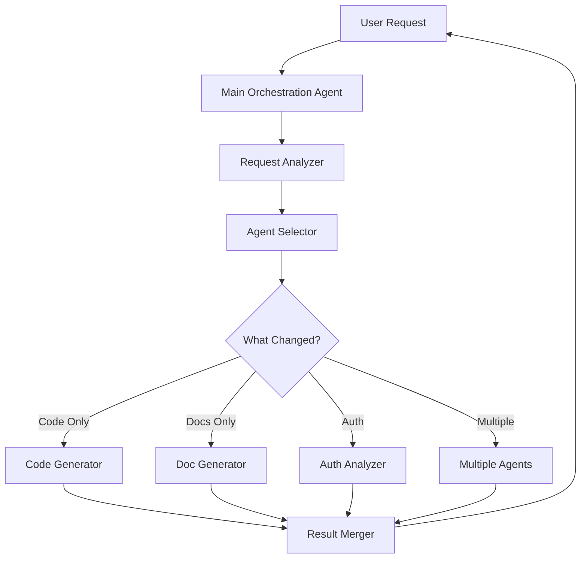
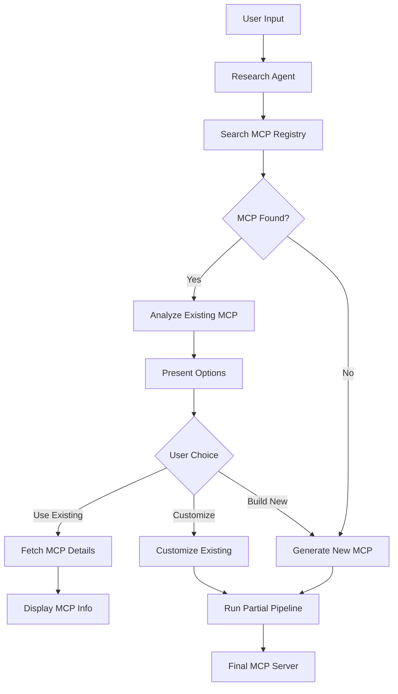
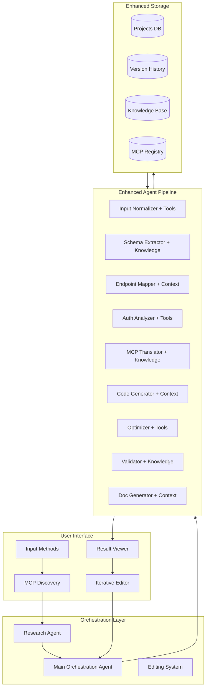

# AutoMCP - Advanced Features & Enhancements

This document outlines advanced features that enhance AutoMCP's capabilities beyond the base multi-agent pipeline, including AI agent tools/knowledge/context, main orchestration agent, iterative editing, and MCP discovery.

## Table of Contents

- [AI Agent Tools, Knowledge & Context](#ai-agent-tools-knowledge--context)
- [Main Orchestration Agent](#main-orchestration-agent)
- [Iterative Editing System](#iterative-editing-system)
- [MCP Discovery & Research Agent](#mcp-discovery--research-agent)
- [Implementation Architecture](#implementation-architecture)

## AI Agent Tools, Knowledge & Context

### Overview

Each AI agent in the pipeline can be enhanced with three types of capabilities:
1. **Tools** - External functions the agent can call
2. **Knowledge** - Domain-specific information and documentation
3. **Context** - Historical data and learned patterns

### Agent-Specific Enhancements

#### 1. Input Normalizer Agent
**Tools:**
- `validate_openapi_spec()` - Validates OpenAPI/Swagger specifications
- `fetch_api_docs()` - Fetches API documentation from URLs
- `parse_markdown()` - Parses Markdown documentation
- `extract_code_samples()` - Extracts code examples from docs

**Knowledge:**
- OpenAPI 2.0/3.0 specification standards
- Common API documentation patterns
- REST API best practices
- Authentication scheme patterns

**Context:**
- Previously normalized API specifications
- Common API naming conventions
- Frequently used authentication types
- API versioning patterns

#### 2. Schema Extractor Agent
**Tools:**
- `infer_json_schema()` - Infers JSON schema from examples
- `validate_data_types()` - Validates data type consistency
- `detect_relationships()` - Detects entity relationships
- `analyze_constraints()` - Analyzes validation constraints

**Knowledge:**
- JSON Schema specification
- Common data validation patterns
- Database schema design principles
- API response structure patterns

**Context:**
- Previously extracted schemas
- Common field naming patterns
- Typical validation rules
- Response structure templates

#### 3. Endpoint Mapper Agent
**Tools:**
- `classify_endpoint()` - Classifies endpoint as tool/resource
- `detect_crud_pattern()` - Detects CRUD operations
- `group_related_endpoints()` - Groups related endpoints
- `generate_mcp_names()` - Generates MCP-compliant names

**Knowledge:**
- MCP protocol specification
- REST API design patterns
- Resource naming conventions
- Tool vs Resource classification rules

**Context:**
- Previously mapped endpoints
- Common endpoint groupings
- MCP naming patterns
- Tool/resource classification history

#### 4. Auth Analyzer Agent
**Tools:**
- `detect_auth_type()` - Detects authentication type
- `analyze_token_flow()` - Analyzes token management
- `validate_security_scheme()` - Validates security configuration
- `generate_auth_code()` - Generates authentication code

**Knowledge:**
- OAuth 2.0 flows
- JWT token management
- API key best practices
- Security vulnerability patterns

**Context:**
- Previously analyzed auth patterns
- Common token refresh strategies
- Security implementation patterns
- Auth error handling approaches

#### 5. MCP Translator Agent
**Tools:**
- `validate_mcp_schema()` - Validates MCP schema
- `generate_tool_schema()` - Generates MCP tool schema
- `create_resource_definition()` - Creates resource definitions
- `optimize_prompt_templates()` - Optimizes prompt templates

**Knowledge:**
- MCP protocol specification
- Tool schema best practices
- Resource definition patterns
- Prompt engineering techniques

**Context:**
- Previously translated MCP schemas
- Successful tool implementations
- Resource definition templates
- Effective prompt patterns

#### 6. Code Generator Agent
**Tools:**
- `generate_boilerplate()` - Generates server boilerplate
- `create_handler_function()` - Creates handler functions
- `add_error_handling()` - Adds error handling code
- `format_code()` - Formats generated code

**Knowledge:**
- Python/TypeScript best practices
- MCP server implementation patterns
- Error handling strategies
- Code organization principles

**Context:**
- Previously generated code patterns
- Successful implementations
- Common code structures
- Reusable code templates

#### 7. Optimizer Agent
**Tools:**
- `analyze_performance()` - Analyzes code performance
- `suggest_optimizations()` - Suggests optimizations
- `add_caching()` - Adds caching strategies
- `implement_rate_limiting()` - Implements rate limiting

**Knowledge:**
- Performance optimization techniques
- Caching strategies
- Rate limiting patterns
- Async/await best practices

**Context:**
- Previously optimized code
- Performance benchmarks
- Successful optimization patterns
- Common bottlenecks

#### 8. Validator Agent
**Tools:**
- `run_static_analysis()` - Runs static code analysis
- `generate_test_cases()` - Generates test cases
- `validate_mcp_compliance()` - Validates MCP compliance
- `check_type_safety()` - Checks type safety

**Knowledge:**
- Testing best practices
- MCP protocol compliance rules
- Type system patterns
- Common error patterns

**Context:**
- Previously validated code
- Common validation issues
- Test case templates
- Compliance check patterns

#### 9. Documentation Generator Agent
**Tools:**
- `generate_readme()` - Generates README files
- `create_api_docs()` - Creates API documentation
- `generate_examples()` - Generates usage examples
- `create_troubleshooting_guide()` - Creates troubleshooting guides

**Knowledge:**
- Documentation best practices
- Markdown formatting standards
- API documentation patterns
- Example code patterns

**Context:**
- Previously generated documentation
- Effective documentation structures
- Common usage patterns
- Troubleshooting templates

### Implementation: Agent with Tools/Knowledge/Context

```python
from typing import List, Dict, Any, Optional, Callable
from pydantic import BaseModel

class AgentTool(BaseModel):
    """Tool that an agent can use"""
    name: str
    description: str
    function: Callable
    parameters: Dict[str, Any]

class AgentKnowledge(BaseModel):
    """Knowledge base for an agent"""
    domain: str
    documents: List[str]
    embeddings: Optional[Any] = None  # Vector embeddings for RAG

class AgentContext(BaseModel):
    """Historical context for an agent"""
    previous_outputs: List[Dict[str, Any]]
    learned_patterns: Dict[str, Any]
    success_metrics: Dict[str, float]

class EnhancedAgent(BaseAgent):
    """Agent with tools, knowledge, and context"""
    
    def __init__(
        self,
        agent_id: str,
        agent_name: str,
        description: str,
        provider: Any,
        tools: Optional[List[AgentTool]] = None,
        knowledge: Optional[AgentKnowledge] = None,
        context: Optional[AgentContext] = None
    ):
        super().__init__(agent_id, agent_name, description, provider)
        self.tools = tools or []
        self.knowledge = knowledge
        self.context = context or AgentContext(
            previous_outputs=[],
            learned_patterns={},
            success_metrics={}
        )
    
    async def use_tool(self, tool_name: str, **kwargs) -> Any:
        """Use a tool by name"""
        tool = next((t for t in self.tools if t.name == tool_name), None)
        if not tool:
            raise ValueError(f"Tool {tool_name} not found")
        
        return await tool.function(**kwargs)
    
    async def query_knowledge(self, query: str) -> List[str]:
        """Query knowledge base using RAG"""
        if not self.knowledge:
            return []
        
        # Use vector similarity search to find relevant documents
        # This would integrate with a vector database like Pinecone or Weaviate
        relevant_docs = await self._vector_search(query, self.knowledge.embeddings)
        return relevant_docs
    
    async def learn_from_output(self, output: Dict[str, Any], success: bool):
        """Learn from agent output"""
        self.context.previous_outputs.append({
            "output": output,
            "success": success,
            "timestamp": datetime.utcnow()
        })
        
        # Update learned patterns
        if success:
            pattern_key = self._extract_pattern_key(output)
            if pattern_key in self.context.learned_patterns:
                self.context.learned_patterns[pattern_key]["count"] += 1
            else:
                self.context.learned_patterns[pattern_key] = {
                    "pattern": output,
                    "count": 1
                }
    
    async def process(self, context: AgentContext) -> AsyncIterator[tuple[float, str, Optional[Dict[str, Any]]]]:
        """Process with tools, knowledge, and context"""
        
        # Query knowledge base for relevant information
        relevant_knowledge = await self.query_knowledge(str(context.input_data))
        
        # Use tools as needed
        if "validate" in self.agent_id:
            validation_result = await self.use_tool("validate_openapi_spec", spec=context.input_data)
        
        # Use historical context to inform decisions
        similar_patterns = self._find_similar_patterns(context.input_data)
        
        # Generate prompt with enhanced context
        enhanced_prompt = self._build_enhanced_prompt(
            context.input_data,
            relevant_knowledge,
            similar_patterns
        )
        
        # Call AI provider with enhanced prompt
        response = await self.provider.generate(enhanced_prompt)
        
        # Learn from this execution
        await self.learn_from_output(response, success=True)
        
        yield (1.0, "Processing complete", {"result": response})
```

## Main Orchestration Agent

### Overview

The Main Orchestration Agent acts as an intelligent coordinator that:
1. Receives user requests for modifications or actions
2. Analyzes what needs to be changed
3. Selects only the required sub-agents
4. Coordinates their execution
5. Returns the updated results

This avoids re-running the entire pipeline for simple edits.

### Architecture



### Request Analysis

The Main Orchestration Agent analyzes requests to determine:
- **Scope**: What parts of the generated output need changes
- **Complexity**: Simple edit vs. structural change
- **Dependencies**: Which agents depend on the changes
- **Agents Required**: Minimum set of agents needed

### Agent Selection Logic

```python
class MainOrchestrationAgent:
    """Main agent that coordinates sub-agents for iterative edits"""
    
    def __init__(self, all_agents: Dict[str, BaseAgent]):
        self.all_agents = all_agents
        self.request_analyzer = RequestAnalyzer()
        self.agent_selector = AgentSelector()
    
    async def handle_user_request(
        self,
        request: str,
        current_project: Project,
        stream_callback: Optional[Callable] = None
    ) -> Project:
        """
        Handle user request for modifications
        
        Args:
            request: User's natural language request
            current_project: Current project state
            stream_callback: Optional callback for progress updates
        
        Returns:
            Updated project
        """
        
        # Analyze the request
        analysis = await self.request_analyzer.analyze(request, current_project)
        
        # Determine which agents are needed
        required_agents = await self.agent_selector.select_agents(analysis)
        
        # Create execution plan
        execution_plan = self._create_execution_plan(required_agents, analysis)
        
        # Execute only required agents
        updated_context = await self._execute_plan(
            execution_plan,
            current_project.context,
            stream_callback
        )
        
        # Merge results with existing project
        updated_project = self._merge_results(current_project, updated_context)
        
        return updated_project
    
    async def _execute_plan(
        self,
        plan: ExecutionPlan,
        context: AgentContext,
        stream_callback: Optional[Callable]
    ) -> AgentContext:
        """Execute the minimal set of agents"""
        
        for step in plan.steps:
            agent = self.all_agents[step.agent_id]
            
            # Only process the specific changes
            focused_context = self._create_focused_context(context, step.scope)
            
            # Execute agent
            updated_context = await agent.execute(focused_context, stream_callback)
            
            # Merge back into main context
            context = self._merge_context(context, updated_context, step.scope)
        
        return context

class RequestAnalyzer:
    """Analyzes user requests to determine required changes"""
    
    async def analyze(self, request: str, project: Project) -> RequestAnalysis:
        """Analyze user request"""
        
        # Use AI to understand the request
        analysis_prompt = f"""
        Analyze this user request for modifying an MCP server:
        
        Request: {request}
        
        Current project state:
        - Generated code: {len(project.generated_code)} files
        - Documentation: {len(project.documentation)} files
        - MCP schema: {project.mcp_schema}
        
        Determine:
        1. What needs to be changed (code, docs, schema, auth, etc.)
        2. Scope of changes (minor edit, major refactor, new feature)
        3. Which parts of the project are affected
        4. Dependencies between changes
        
        Return JSON with: scope, affected_components, change_type, complexity
        """
        
        response = await self.ai_provider.generate(analysis_prompt)
        return RequestAnalysis.parse_obj(json.loads(response))

class AgentSelector:
    """Selects minimum set of agents needed for changes"""
    
    # Agent dependency graph
    AGENT_DEPENDENCIES = {
        "code_generator": ["mcp_translator"],
        "optimizer": ["code_generator"],
        "validator": ["optimizer"],
        "doc_generator": ["validator"],
        "mcp_translator": ["auth_analyzer", "endpoint_mapper"],
        "auth_analyzer": ["endpoint_mapper"],
        "endpoint_mapper": ["schema_extractor"],
        "schema_extractor": ["input_normalizer"]
    }
    
    async def select_agents(self, analysis: RequestAnalysis) -> List[str]:
        """Select agents based on analysis"""
        
        required_agents = set()
        
        # Map affected components to agents
        component_to_agent = {
            "code": ["code_generator", "optimizer"],
            "documentation": ["doc_generator"],
            "authentication": ["auth_analyzer", "mcp_translator", "code_generator"],
            "endpoints": ["endpoint_mapper", "mcp_translator", "code_generator"],
            "schema": ["schema_extractor", "endpoint_mapper", "mcp_translator"],
            "validation": ["validator"]
        }
        
        # Add agents for affected components
        for component in analysis.affected_components:
            if component in component_to_agent:
                required_agents.update(component_to_agent[component])
        
        # Add dependencies
        agents_with_deps = self._add_dependencies(required_agents)
        
        # Sort by execution order
        sorted_agents = self._topological_sort(agents_with_deps)
        
        return sorted_agents
    
    def _add_dependencies(self, agents: Set[str]) -> Set[str]:
        """Add required dependencies for agents"""
        result = set(agents)
        
        for agent in agents:
            if agent in self.AGENT_DEPENDENCIES:
                deps = self.AGENT_DEPENDENCIES[agent]
                result.update(deps)
                # Recursively add dependencies
                result.update(self._add_dependencies(set(deps)))
        
        return result
```

### Example Usage Scenarios

#### Scenario 1: User wants to change authentication
```python
# User request: "Change authentication from API key to OAuth 2.0"

# Main Orchestration Agent analyzes:
# - Affected: authentication, code, documentation
# - Required agents: auth_analyzer, mcp_translator, code_generator, doc_generator
# - Skip: input_normalizer, schema_extractor, endpoint_mapper, optimizer, validator

# Execution:
# 1. Auth Analyzer: Analyze OAuth 2.0 requirements
# 2. MCP Translator: Update MCP schema with new auth
# 3. Code Generator: Regenerate auth-related code only
# 4. Doc Generator: Update authentication documentation

# Result: Updated project with OAuth 2.0, ~4 agents instead of 9
```

#### Scenario 2: User wants to add caching
```python
# User request: "Add caching to all GET endpoints"

# Main Orchestration Agent analyzes:
# - Affected: code optimization
# - Required agents: optimizer only
# - Skip: all other agents

# Execution:
# 1. Optimizer: Add caching middleware to existing code

# Result: Updated code with caching, 1 agent instead of 9
```

#### Scenario 3: User wants to fix documentation typo
```python
# User request: "Fix typo in README: 'instalation' should be 'installation'"

# Main Orchestration Agent analyzes:
# - Affected: documentation only
# - Required agents: doc_generator only
# - Skip: all other agents

# Execution:
# 1. Doc Generator: Fix typo in README

# Result: Updated documentation, 1 agent instead of 9
```

## Iterative Editing System

### Overview

The Iterative Editing System allows users to:
1. Edit generated MCP server code
2. Edit generated documentation
3. Edit API specifications
4. Regenerate affected parts only

### Edit Modes

#### 1. Code Editing
- **Direct Edit**: User edits code in Monaco Editor
- **AI-Assisted Edit**: User describes changes, AI applies them
- **Refactor**: User requests refactoring, AI suggests changes

#### 2. Documentation Editing
- **Direct Edit**: User edits Markdown documentation
- **AI-Assisted Edit**: User describes changes, AI updates docs
- **Regenerate**: Regenerate docs from updated code

#### 3. Specification Editing
- **Direct Edit**: User edits normalized API spec
- **AI-Assisted Edit**: User describes changes, AI updates spec
- **Propagate**: Propagate changes through pipeline

### Implementation

```python
class IterativeEditingSystem:
    """System for iterative editing of generated outputs"""
    
    def __init__(
        self,
        main_orchestrator: MainOrchestrationAgent,
        version_control: VersionControl
    ):
        self.orchestrator = main_orchestrator
        self.version_control = version_control
    
    async def edit_code(
        self,
        project: Project,
        file_path: str,
        edit_request: Union[str, CodeEdit],
        mode: Literal["direct", "ai_assisted", "refactor"]
    ) -> Project:
        """Edit generated code"""
        
        if mode == "direct":
            # User provides exact changes
            updated_code = edit_request.new_content
        
        elif mode == "ai_assisted":
            # AI applies changes based on description
            edit_prompt = f"""
            Apply this change to the code:
            
            File: {file_path}
            Current code:
            {project.generated_code[file_path]}
            
            Requested change: {edit_request}
            
            Return the updated code.
            """
            updated_code = await self.ai_provider.generate(edit_prompt)
        
        elif mode == "refactor":
            # AI suggests refactoring
            refactor_prompt = f"""
            Refactor this code:
            
            File: {file_path}
            Current code:
            {project.generated_code[file_path]}
            
            Refactoring goal: {edit_request}
            
            Return refactored code with improvements.
            """
            updated_code = await self.ai_provider.generate(refactor_prompt)
        
        # Create new version
        new_version = self.version_control.create_version(
            project,
            changes={file_path: updated_code},
            description=f"Code edit: {edit_request}"
        )
        
        # Check if other files need updates
        affected_files = await self._analyze_dependencies(file_path, updated_code)
        
        if affected_files:
            # Use Main Orchestrator to update dependent files
            request = f"Update files affected by changes to {file_path}"
            new_version = await self.orchestrator.handle_user_request(
                request,
                new_version
            )
        
        return new_version
    
    async def edit_documentation(
        self,
        project: Project,
        doc_path: str,
        edit_request: Union[str, DocEdit],
        mode: Literal["direct", "ai_assisted", "regenerate"]
    ) -> Project:
        """Edit generated documentation"""
        
        if mode == "direct":
            updated_doc = edit_request.new_content
        
        elif mode == "ai_assisted":
            edit_prompt = f"""
            Update this documentation:
            
            File: {doc_path}
            Current content:
            {project.documentation[doc_path]}
            
            Requested change: {edit_request}
            
            Return updated documentation.
            """
            updated_doc = await self.ai_provider.generate(edit_prompt)
        
        elif mode == "regenerate":
            # Regenerate from current code
            request = f"Regenerate documentation for {doc_path}"
            return await self.orchestrator.handle_user_request(request, project)
        
        # Update documentation
        new_version = self.version_control.create_version(
            project,
            changes={doc_path: updated_doc},
            description=f"Documentation edit: {edit_request}"
        )
        
        return new_version
    
    async def edit_specification(
        self,
        project: Project,
        spec_changes: Dict[str, Any],
        propagate: bool = True
    ) -> Project:
        """Edit API specification"""
        
        # Update specification
        updated_spec = {**project.normalized_spec, **spec_changes}
        
        if not propagate:
            # Just update spec, don't regenerate
            project.normalized_spec = updated_spec
            return project
        
        # Propagate changes through pipeline
        request = f"Update MCP server based on specification changes: {spec_changes}"
        updated_project = await self.orchestrator.handle_user_request(
            request,
            project
        )
        
        return updated_project

class VersionControl:
    """Version control for projects"""
    
    def create_version(
        self,
        project: Project,
        changes: Dict[str, str],
        description: str
    ) -> Project:
        """Create new version with changes"""
        
        new_project = project.copy(deep=True)
        new_project.version += 1
        new_project.version_history.append({
            "version": new_project.version,
            "timestamp": datetime.utcnow(),
            "description": description,
            "changes": changes
        })
        
        # Apply changes
        for path, content in changes.items():
            if path in new_project.generated_code:
                new_project.generated_code[path] = content
            elif path in new_project.documentation:
                new_project.documentation[path] = content
        
        return new_project
    
    def rollback(self, project: Project, version: int) -> Project:
        """Rollback to previous version"""
        
        # Find version in history
        version_data = next(
            (v for v in project.version_history if v["version"] == version),
            None
        )
        
        if not version_data:
            raise ValueError(f"Version {version} not found")
        
        # Reconstruct project at that version
        # This would involve replaying changes from history
        return self._reconstruct_version(project, version)
```

## MCP Discovery & Research Agent

### Overview

The MCP Discovery & Research Agent:
1. Searches for existing MCP servers before generation
2. Analyzes existing implementations
3. Provides options to user:
   - Use existing MCP server
   - Customize existing MCP server
   - Build new MCP server from scratch

### Architecture



### MCP Registry Integration

```python
class MCPDiscoveryAgent:
    """Agent that discovers existing MCP servers"""
    
    def __init__(self, registry_client: MCPRegistryClient):
        self.registry = registry_client
        self.analyzer = MCPAnalyzer()
    
    async def search_existing_mcps(
        self,
        api_spec: NormalizedAPISpec
    ) -> List[ExistingMCP]:
        """Search for existing MCP servers"""
        
        # Extract search criteria
        search_criteria = {
            "api_name": api_spec.metadata.name,
            "base_url": api_spec.metadata.baseUrl,
            "endpoints": [ep.path for ep in api_spec.endpoints],
            "auth_type": api_spec.authentication.type
        }
        
        # Search multiple sources
        results = []
        
        # 1. Official MCP Registry
        official_results = await self.registry.search(search_criteria)
        results.extend(official_results)
        
        # 2. GitHub repositories
        github_results = await self._search_github(search_criteria)
        results.extend(github_results)
        
        # 3. npm/PyPI packages
        package_results = await self._search_packages(search_criteria)
        results.extend(package_results)
        
        # Rank by relevance
        ranked_results = self._rank_by_relevance(results, api_spec)
        
        return ranked_results
    
    async def analyze_existing_mcp(
        self,
        mcp: ExistingMCP
    ) -> MCPAnalysis:
        """Analyze existing MCP server"""
        
        # Fetch MCP details
        mcp_details = await self.registry.get_details(mcp.id)
        
        # Analyze coverage
        coverage = await self.analyzer.analyze_coverage(
            mcp_details.endpoints,
            mcp_details.tools
        )
        
        # Analyze quality
        quality = await self.analyzer.analyze_quality(
            mcp_details.code,
            mcp_details.tests,
            mcp_details.documentation
        )
        
        # Analyze customization potential
        customization = await self.analyzer.analyze_customization(
            mcp_details.architecture,
            mcp_details.extensibility
        )
        
        return MCPAnalysis(
            mcp=mcp,
            coverage=coverage,
            quality=quality,
            customization=customization,
            recommendation=self._generate_recommendation(coverage, quality, customization)
        )
    
    def _generate_recommendation(
        self,
        coverage: CoverageAnalysis,
        quality: QualityAnalysis,
        customization: CustomizationAnalysis
    ) -> str:
        """Generate recommendation for user"""
        
        if coverage.percentage > 90 and quality.score > 8:
            return "use_existing"
        elif coverage.percentage > 60 and customization.difficulty == "easy":
            return "customize_existing"
        else:
            return "build_new"

class MCPRegistryClient:
    """Client for MCP registry"""
    
    def __init__(self, registry_url: str):
        self.registry_url = registry_url
        self.client = httpx.AsyncClient()
    
    async def search(self, criteria: Dict[str, Any]) -> List[ExistingMCP]:
        """Search MCP registry"""
        
        response = await self.client.post(
            f"{self.registry_url}/search",
            json=criteria
        )
        response.raise_for_status()
        
        results = response.json()
        return [ExistingMCP.parse_obj(r) for r in results]
    
    async def get_details(self, mcp_id: str) -> MCPDetails:
        """Get detailed information about an MCP"""
        
        response = await self.client.get(
            f"{self.registry_url}/mcps/{mcp_id}"
        )
        response.raise_for_status()
        
        return MCPDetails.parse_obj(response.json())

class MCPAnalyzer:
    """Analyzes existing MCP servers"""
    
    async def analyze_coverage(
        self,
        api_endpoints: List[str],
        mcp_tools: List[str]
    ) -> CoverageAnalysis:
        """Analyze endpoint coverage"""
        
        covered_endpoints = set()
        
        for tool in mcp_tools:
            # Match tool to endpoint
            matching_endpoint = self._match_tool_to_endpoint(tool, api_endpoints)
            if matching_endpoint:
                covered_endpoints.add(matching_endpoint)
        
        coverage_percentage = len(covered_endpoints) / len(api_endpoints) * 100
        
        return CoverageAnalysis(
            total_endpoints=len(api_endpoints),
            covered_endpoints=len(covered_endpoints),
            percentage=coverage_percentage,
            missing_endpoints=list(set(api_endpoints) - covered_endpoints)
        )
    
    async def analyze_quality(
        self,
        code: str,
        tests: Optional[str],
        documentation: Optional[str]
    ) -> QualityAnalysis:
        """Analyze MCP quality"""
        
        scores = {
            "code_quality": await self._analyze_code_quality(code),
            "test_coverage": await self._analyze_test_coverage(tests),
            "documentation_quality": await self._analyze_documentation(documentation),
            "error_handling": await self._analyze_error_handling(code),
            "type_safety": await self._analyze_type_safety(code)
        }
        
        overall_score = sum(scores.values()) / len(scores)
        
        return QualityAnalysis(
            scores=scores,
            overall_score=overall_score,
            strengths=self._identify_strengths(scores),
            weaknesses=self._identify_weaknesses(scores)
        )
    
    async def analyze_customization(
        self,
        architecture: Dict[str, Any],
        extensibility: Dict[str, Any]
    ) -> CustomizationAnalysis:
        """Analyze customization potential"""
        
        # Check for extension points
        has_middleware = "middleware" in architecture
        has_hooks = "hooks" in extensibility
        has_plugins = "plugins" in extensibility
        
        # Determine difficulty
        if has_middleware and has_hooks and has_plugins:
            difficulty = "easy"
        elif has_middleware or has_hooks:
            difficulty = "medium"
        else:
            difficulty = "hard"
        
        return CustomizationAnalysis(
            difficulty=difficulty,
            extension_points=extensibility.get("points", []),
            customization_guide=extensibility.get("guide"),
            examples=extensibility.get("examples", [])
        )
```

### User Interface Flow

```typescript
// Frontend component for MCP discovery
interface MCPDiscoveryProps {
  apiSpec: NormalizedAPISpec;
  onChoice: (choice: MCPChoice) => void;
}

function MCPDiscovery({ apiSpec, onChoice }: MCPDiscoveryProps) {
  const [searching, setSearching] = useState(true);
  const [results, setResults] = useState<ExistingMCP[]>([]);
  const [selectedMCP, setSelectedMCP] = useState<ExistingMCP | null>(null);
  const [analysis, setAnalysis] = useState<MCPAnalysis | null>(null);
  
  useEffect(() => {
    searchExistingMCPs();
  }, [apiSpec]);
  
  async function searchExistingMCPs() {
    setSearching(true);
    const response = await fetch('/api/discover-mcps', {
      method: 'POST',
      body: JSON.stringify({ apiSpec })
    });
    const data = await response.json();
    setResults(data.results);
    setSearching(false);
  }
  
  async function analyzeMCP(mcp: ExistingMCP) {
    setSelectedMCP(mcp);
    const response = await fetch(`/api/analyze-mcp/${mcp.id}`);
    const data = await response.json();
    setAnalysis(data.analysis);
  }
  
  return (
    <div className="mcp-discovery">
      {searching ? (
        <LoadingSpinner message="Searching for existing MCP servers..." />
      ) : results.length > 0 ? (
        <div>
          <h2>Found {results.length} existing MCP server(s)</h2>
          
          <div className="mcp-results">
            {results.map(mcp => (
              <MCPCard
                key={mcp.id}
                mcp={mcp}
                onAnalyze={() => analyzeMCP(mcp)}
              />
            ))}
          </div>
          
          {analysis && (
            <MCPAnalysisView
              analysis={analysis}
              onUseExisting={() => onChoice({ type: 'use_existing', mcp: selectedMCP })}
              onCustomize={() => onChoice({ type: 'customize', mcp: selectedMCP })}
              onBuildNew={() => onChoice({ type: 'build_new' })}
            />
          )}
        </div>
      ) : (
        <div>
          <h2>No existing MCP servers found</h2>
          <p>We'll build a new MCP server for you.</p>
          <button onClick={() => onChoice({ type: 'build_new' })}>
            Build New MCP Server
          </button>
        </div>
      )}
    </div>
  );
}
```

### Customization Flow

When user chooses to customize an existing MCP:

```python
async def customize_existing_mcp(
    existing_mcp: ExistingMCP,
    api_spec: NormalizedAPISpec,
    customization_requests: List[str]
) -> Project:
    """Customize existing MCP server"""
    
    # Fetch existing MCP code
    mcp_code = await fetch_mcp_code(existing_mcp)
    
    # Analyze what needs to be added/changed
    gap_analysis = await analyze_gaps(mcp_code, api_spec)
    
    # Determine which agents to run
    required_agents = []
    
    if gap_analysis.missing_endpoints:
        required_agents.extend([
            "endpoint_mapper",
            "mcp_translator",
            "code_generator"
        ])
    
    if gap_analysis.auth_differences:
        required_agents.extend([
            "auth_analyzer",
            "mcp_translator",
            "code_generator"
        ])
    
    # Run only required agents
    orchestrator = MainOrchestrationAgent(all_agents)
    
    # Create context with existing MCP as base
    context = AgentContext(
        session_id=generate_session_id(),
        input_data=api_spec,
        existing_mcp=mcp_code,
        customization_mode=True
    )
    
    # Execute customization
    for agent_id in required_agents:
        agent = all_agents[agent_id]
        context = await agent.execute(context)
    
    # Merge with existing MCP
    customized_mcp = merge_with_existing(mcp_code, context.generated_code)
    
    return Project(
        name=f"{existing_mcp.name}-customized",
        generated_code=customized_mcp,
        base_mcp=existing_mcp,
        customizations=customization_requests
    )
```

## Implementation Architecture

### Updated System Architecture



### Integration Points

1. **Tools/Knowledge/Context** integrate into each agent's `process()` method
2. **Main Orchestration Agent** wraps the agent pipeline
3. **Iterative Editing System** uses Main Orchestration Agent
4. **Research Agent** runs before pipeline execution

### Configuration

```yaml
# config/advanced_features.yaml

main_orchestration:
  enabled: true
  request_analyzer:
    model: "gpt-4"
    temperature: 0.3
  agent_selector:
    optimization: "minimal"  # or "comprehensive"

iterative_editing:
  enabled: true
  version_control:
    max_versions: 50
    auto_save: true
  ai_assisted_editing:
    model: "gpt-4"
    temperature: 0.2

mcp_discovery:
  enabled: true
  registries:
    - url: "https://registry.modelcontextprotocol.io"
      priority: 1
    - url: "https://github.com/search"
      priority: 2
    - url: "https://npmjs.com/search"
      priority: 3
  analysis:
    coverage_threshold: 60  # %
    quality_threshold: 7    # out of 10

agent_enhancements:
  tools:
    enabled: true
    timeout: 30  # seconds
  knowledge:
    enabled: true
    vector_db: "pinecone"  # or "weaviate", "qdrant"
    embedding_model: "text-embedding-ada-002"
  context:
    enabled: true
    max_history: 100
    learning_rate: 0.1
```

## Summary

These advanced features transform AutoMCP from a one-time generation tool into an intelligent, iterative development platform:

1. **Tools/Knowledge/Context** make agents smarter and more capable
2. **Main Orchestration Agent** enables efficient iterative editing
3. **Iterative Editing System** allows continuous refinement
4. **MCP Discovery** prevents duplicate work and leverages existing solutions

Together, these features provide a superior user experience and significantly reduce development time.