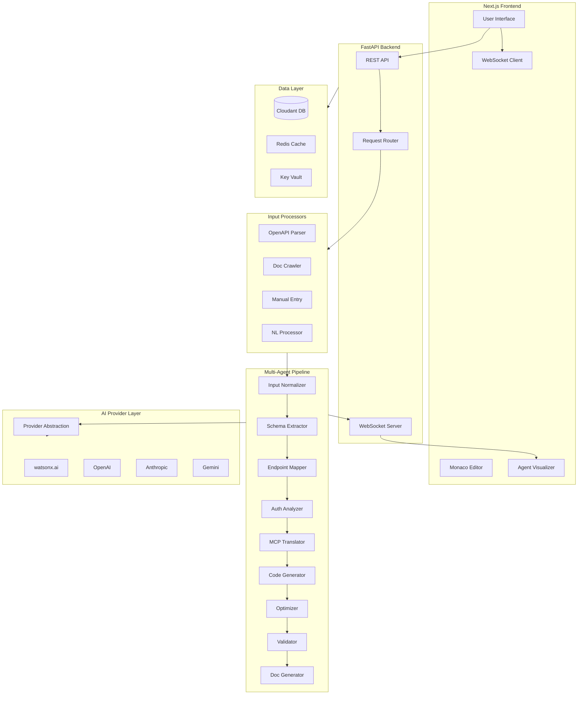
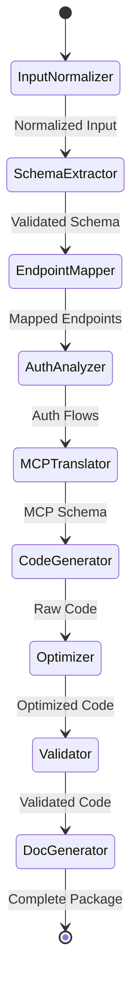

# AutoMCP - Architecture & Implementation Plan

## Executive Summary

AutoMCP is a production-ready web application that automatically generates Model Context Protocol (MCP) server code from API specifications. This document outlines the complete architecture, technology stack, and phased implementation strategy.

## Technology Stack Decision

### Backend: Python FastAPI
**Rationale:**
- Native async/await support for WebSocket streaming
- Excellent for AI/ML integration (IBM watsonx.ai SDK)
- Strong typing with Pydantic for data validation
- Fast performance and easy deployment
- Rich ecosystem for API parsing (openapi-spec-validator, pyyaml)

### Frontend: Next.js 14+ (React)
**Rationale:**
- Server-side rendering for better SEO and performance
- Built-in API routes for backend-for-frontend pattern
- Excellent WebSocket/SSE support
- TypeScript support for type safety
- Rich component ecosystem (Monaco Editor, React Flow)

### Database: IBM Cloudant (CouchDB)
**Rationale:**
- Document-based storage perfect for JSON API specs
- Built-in replication for collaboration features
- Scalable and managed by IBM Cloud
- RESTful API for easy integration
- Offline-first capabilities

### AI Provider: Multi-Provider Architecture
**Primary:** IBM watsonx.ai (Granite models)
**Secondary:** OpenAI, Anthropic, Google Gemini, Custom endpoints

### Deployment: IBM Cloud Code Engine
**Rationale:**
- Serverless container platform
- Auto-scaling based on demand
- Built-in CI/CD integration
- Cost-effective for variable workloads

## System Architecture



## Multi-Agent Pipeline Architecture

### Agent Flow and Responsibilities



### Agent Specifications

#### 1. Input Normalizer Agent
- **Role:** Standardize all input formats into unified schema
- **Input:** Raw API specs (OpenAPI, docs, manual, NL)
- **Output:** Normalized API specification JSON
- **AI Model:** Granite-13b-chat for structure understanding
- **Key Tasks:**
  - Parse different input formats
  - Extract common patterns
  - Validate basic structure
  - Normalize naming conventions

#### 2. Schema Extractor Agent
- **Role:** Deep analysis of API structure and relationships
- **Input:** Normalized specification
- **Output:** Detailed schema with types, constraints, relationships
- **AI Model:** Granite-20b-code for schema inference
- **Key Tasks:**
  - Infer missing type information
  - Detect data relationships
  - Extract validation rules
  - Identify response schemas

#### 3. Endpoint Mapper Agent
- **Role:** Map endpoints to MCP tools and resources
- **Input:** Detailed schema
- **Output:** MCP tool/resource mappings
- **AI Model:** GPT-4 for complex mapping logic
- **Key Tasks:**
  - Group related endpoints
  - Determine tool vs resource classification
  - Create logical naming hierarchy
  - Detect CRUD patterns

#### 4. Authentication Analyzer Agent
- **Role:** Analyze and implement auth flows
- **Input:** API specification with auth requirements
- **Output:** Auth implementation strategy
- **AI Model:** Claude-3 for security analysis
- **Key Tasks:**
  - Identify auth types (OAuth, API Key, JWT, etc.)
  - Design token management
  - Implement refresh logic
  - Handle auth errors

#### 5. MCP Translator Agent
- **Role:** Translate API patterns to MCP protocol
- **Input:** Mapped endpoints and auth strategy
- **Output:** MCP protocol specification
- **AI Model:** Granite-13b-instruct for protocol translation
- **Key Tasks:**
  - Define MCP tools schema
  - Create resource definitions
  - Map parameters to MCP format
  - Design prompt templates

#### 6. Code Generator Agent
- **Role:** Generate production-ready code
- **Input:** MCP specification
- **Output:** Complete server code (Python/TypeScript)
- **AI Model:** Granite-34b-code for code generation
- **Key Tasks:**
  - Generate server boilerplate
  - Implement tool handlers
  - Create resource providers
  - Add error handling

#### 7. Optimizer Agent
- **Role:** Apply best practices and optimizations
- **Input:** Raw generated code
- **Output:** Optimized, production-ready code
- **AI Model:** GPT-4 for code review
- **Key Tasks:**
  - Add caching strategies
  - Implement rate limiting
  - Optimize async operations
  - Add logging and monitoring

#### 8. Validator Agent
- **Role:** Test and validate generated code
- **Input:** Optimized code
- **Output:** Validation report and fixes
- **AI Model:** Claude-3 for testing logic
- **Key Tasks:**
  - Generate test cases
  - Validate MCP protocol compliance
  - Check error handling
  - Verify type safety

#### 9. Documentation Generator Agent
- **Role:** Create comprehensive documentation
- **Input:** Validated code and specifications
- **Output:** README, API docs, usage examples
- **AI Model:** GPT-4 for documentation
- **Key Tasks:**
  - Generate README files
  - Create usage examples
  - Document configuration
  - Add troubleshooting guides

## Project Structure

```
automcp/
├── backend/
│   ├── app/
│   │   ├── __init__.py
│   │   ├── main.py                    # FastAPI application entry
│   │   ├── config.py                  # Configuration management
│   │   ├── agents/
│   │   │   ├── __init__.py
│   │   │   ├── base.py                # Base agent class
│   │   │   ├── orchestrator.py       # Agent pipeline orchestrator
│   │   │   ├── input_normalizer.py
│   │   │   ├── schema_extractor.py
│   │   │   ├── endpoint_mapper.py
│   │   │   ├── auth_analyzer.py
│   │   │   ├── mcp_translator.py
│   │   │   ├── code_generator.py
│   │   │   ├── optimizer.py
│   │   │   ├── validator.py
│   │   │   └── doc_generator.py
│   │   ├── api/
│   │   │   ├── __init__.py
│   │   │   ├── routes/
│   │   │   │   ├── __init__.py
│   │   │   │   ├── projects.py
│   │   │   │   ├── generate.py
│   │   │   │   ├── templates.py
│   │   │   │   └── health.py
│   │   │   └── websocket/
│   │   │       ├── __init__.py
│   │   │       └── generation_stream.py
│   │   ├── services/
│   │   │   ├── __init__.py
│   │   │   ├── input_processors/
│   │   │   │   ├── __init__.py
│   │   │   │   ├── openapi_parser.py
│   │   │   │   ├── doc_crawler.py
│   │   │   │   ├── manual_entry.py
│   │   │   │   └── nl_processor.py
│   │   │   ├── providers/
│   │   │   │   ├── __init__.py
│   │   │   │   ├── base.py
│   │   │   │   ├── watsonx.py
│   │   │   │   ├── openai.py
│   │   │   │   ├── anthropic.py
│   │   │   │   └── gemini.py
│   │   │   ├── code_generation/
│   │   │   │   ├── __init__.py
│   │   │   │   ├── python_generator.py
│   │   │   │   ├── typescript_generator.py
│   │   │   │   └── templates/
│   │   │   │       ├── python/
│   │   │   │       └── typescript/
│   │   │   ├── storage/
│   │   │   │   ├── __init__.py
│   │   │   │   ├── cloudant.py
│   │   │   │   └── cache.py
│   │   │   └── security/
│   │   │       ├── __init__.py
│   │   │       ├── encryption.py
│   │   │       └── key_manager.py
│   │   ├── models/
│   │   │   ├── __init__.py
│   │   │   ├── api_spec.py
│   │   │   ├── agent_state.py
│   │   │   ├── generation_request.py
│   │   │   ├── project.py
│   │   │   └── provider_config.py
│   │   └── utils/
│   │       ├── __init__.py
│   │       ├── validators.py
│   │       ├── parsers.py
│   │       └── logger.py
│   ├── tests/
│   │   ├── __init__.py
│   │   ├── test_agents/
│   │   ├── test_services/
│   │   └── test_api/
│   ├── requirements.txt
│   ├── Dockerfile
│   └── pyproject.toml
├── frontend/
│   ├── src/
│   │   ├── app/
│   │   │   ├── layout.tsx
│   │   │   ├── page.tsx
│   │   │   ├── projects/
│   │   │   │   ├── page.tsx
│   │   │   │   └── [id]/
│   │   │   │       └── page.tsx
│   │   │   ├── generate/
│   │   │   │   └── page.tsx
│   │   │   └── templates/
│   │   │       └── page.tsx
│   │   ├── components/
│   │   │   ├── input/
│   │   │   │   ├── OpenAPIUpload.tsx
│   │   │   │   ├── DocumentationURL.tsx
│   │   │   │   ├── ManualEntry.tsx
│   │   │   │   └── NaturalLanguage.tsx
│   │   │   ├── visualization/
│   │   │   │   ├── AgentPipeline.tsx
│   │   │   │   ├── AgentCard.tsx
│   │   │   │   └── ProgressBar.tsx
│   │   │   ├── editor/
│   │   │   │   ├── CodeViewer.tsx
│   │   │   │   ├── DiffViewer.tsx
│   │   │   │   └── MonacoWrapper.tsx
│   │   │   ├── providers/
│   │   │   │   ├── ProviderSelector.tsx
│   │   │   │   └── APIKeyManager.tsx
│   │   │   └── common/
│   │   │       ├── Header.tsx
│   │   │       ├── Sidebar.tsx
│   │   │       └── LoadingSpinner.tsx
│   │   ├── hooks/
│   │   │   ├── useWebSocket.ts
│   │   │   ├── useAgentStream.ts
│   │   │   └── useProject.ts
│   │   ├── lib/
│   │   │   ├── api.ts
│   │   │   ├── websocket.ts
│   │   │   └── storage.ts
│   │   ├── types/
│   │   │   ├── agent.ts
│   │   │   ├── project.ts
│   │   │   └── api.ts
│   │   └── styles/
│   │       └── globals.css
│   ├── public/
│   ├── package.json
│   ├── tsconfig.json
│   ├── next.config.js
│   └── tailwind.config.js
├── shared/
│   └── types/
│       ├── api-spec.ts
│       ├── mcp-schema.ts
│       └── generation.ts
├── deployment/
│   ├── ibm-cloud/
│   │   ├── code-engine/
│   │   │   ├── backend.yaml
│   │   │   └── frontend.yaml
│   │   └── cloudant/
│   │       └── setup.sh
│   ├── docker/
│   │   ├── docker-compose.yml
│   │   ├── backend.Dockerfile
│   │   └── frontend.Dockerfile
│   └── kubernetes/
│       ├── backend-deployment.yaml
│       ├── frontend-deployment.yaml
│       └── ingress.yaml
├── docs/
│   ├── API.md
│   ├── AGENTS.md
│   ├── DEPLOYMENT.md
│   └── DEVELOPMENT.md
├── .github/
│   └── workflows/
│       ├── ci.yml
│       └── deploy.yml
├── .env.example
├── README.md
└── LICENSE
```

## Implementation Phases

### Phase 1: Foundation (Week 1-2)
**Goal:** Set up project structure and core infrastructure

**Tasks:**
1. Initialize monorepo with backend and frontend
2. Set up FastAPI with basic routing and WebSocket support
3. Initialize Next.js with TypeScript and Tailwind CSS
4. Configure development environment (Docker Compose)
5. Set up testing frameworks (pytest, Jest)
6. Create base models and types
7. Implement configuration management
8. Set up logging and monitoring infrastructure

**Deliverables:**
- Working dev environment
- Basic API health check endpoint
- Frontend landing page
- CI/CD pipeline skeleton

### Phase 2: Provider Abstraction Layer (Week 2-3)
**Goal:** Build multi-provider AI integration

**Tasks:**
1. Design provider abstraction interface
2. Implement IBM watsonx.ai provider
3. Implement OpenAI provider
4. Implement Anthropic provider
5. Implement Gemini provider
6. Add streaming response support
7. Implement token counting and rate limiting
8. Create provider configuration UI
9. Build API key encryption system
10. Add provider health checks

**Deliverables:**
- Working provider abstraction layer
- All providers integrated and tested
- Secure API key management
- Provider selection UI

### Phase 3: Input Processors (Week 3-4)
**Goal:** Implement all four input methods

**Tasks:**
1. Build OpenAPI/Swagger parser with validation
2. Implement documentation URL crawler
3. Create HTML/Markdown parser for docs
4. Build manual entry form and validation
5. Implement natural language processor
6. Create input normalization pipeline
7. Add input validation and error handling
8. Build input preview components
9. Implement file upload handling
10. Add URL validation and security checks

**Deliverables:**
- All four input methods working
- Unified normalized output format
- Input validation and error handling
- User-friendly input interfaces

### Phase 4: Agent Pipeline Core (Week 4-6)
**Goal:** Build multi-agent orchestration system

**Tasks:**
1. Design agent base class and interfaces
2. Implement agent orchestrator with state management
3. Build WebSocket streaming for agent updates
4. Create agent communication protocol
5. Implement Input Normalizer agent
6. Implement Schema Extractor agent
7. Implement Endpoint Mapper agent
8. Implement Auth Analyzer agent
9. Implement MCP Translator agent
10. Add agent error handling and recovery
11. Build agent visualization components
12. Create real-time progress tracking

**Deliverables:**
- Working agent pipeline (first 5 agents)
- Real-time agent visualization
- State management and recovery
- Agent communication protocol

### Phase 5: Code Generation (Week 6-8)
**Goal:** Implement code generation agents and templates

**Tasks:**
1. Implement Code Generator agent
2. Implement Optimizer agent
3. Implement Validator agent
4. Implement Documentation Generator agent
5. Create Python MCP server templates
6. Create TypeScript MCP server templates
7. Build code generation utilities
8. Implement syntax highlighting
9. Add code export functionality
10. Create diff viewer for regeneration
11. Build Monaco Editor integration
12. Add code download and packaging

**Deliverables:**
- Complete agent pipeline (all 9 agents)
- Python and TypeScript code generation
- Code viewer with syntax highlighting
- Export and download functionality

### Phase 6: Data Persistence (Week 8-9)
**Goal:** Implement project management and storage

**Tasks:**
1. Set up IBM Cloudant database
2. Design database schema for projects
3. Implement project CRUD operations
4. Build project versioning system
5. Create project listing and search
6. Implement code history tracking
7. Add template library storage
8. Build configuration persistence
9. Implement Redis caching layer
10. Create backup and restore functionality

**Deliverables:**
- Working project management system
- Cloudant integration
- Project versioning
- Template library

### Phase 7: Testing & Validation (Week 9-10)
**Goal:** Build testing interface and validation

**Tasks:**
1. Create MCP server testing framework
2. Build mock request interface
3. Implement response validation
4. Add protocol compliance checking
5. Create test case generator
6. Build testing UI components
7. Implement automated testing
8. Add performance benchmarking
9. Create validation reports
10. Build error reproduction tools

**Deliverables:**
- Testing interface
- Validation framework
- Test case generation
- Performance metrics

### Phase 8: Security & Production Readiness (Week 10-11)
**Goal:** Harden security and prepare for production

**Tasks:**
1. Implement input sanitization
2. Add rate limiting and throttling
3. Enhance API key encryption
4. Implement audit logging
5. Add CORS and security headers
6. Create security scanning pipeline
7. Implement error tracking (Sentry)
8. Add monitoring and alerting
9. Create health check endpoints
10. Build admin dashboard

**Deliverables:**
- Production-ready security
- Monitoring and alerting
- Admin tools
- Security documentation

### Phase 9: Advanced Features (Week 11-13)
**Goal:** Implement collaboration and analytics

**Tasks:**
1. Build analytics dashboard
2. Implement usage tracking
3. Create collaboration features
4. Add project sharing
5. Build team management
6. Implement access control
7. Create activity feeds
8. Add notification system
9. Build export formats (Docker, packages)
10. Implement custom transformers API

**Deliverables:**
- Analytics dashboard
- Collaboration features
- Advanced export options
- Extensibility system

### Phase 10: Deployment & Documentation (Week 13-14)
**Goal:** Deploy to IBM Cloud and finalize documentation

**Tasks:**
1. Configure IBM Cloud Code Engine
2. Set up CI/CD pipeline
3. Implement auto-scaling
4. Configure environment variables
5. Set up domain and SSL
6. Create deployment documentation
7. Write API documentation
8. Create user guides
9. Build video tutorials
10. Prepare launch materials

**Deliverables:**
- Production deployment on IBM Cloud
- Complete documentation
- User guides and tutorials
- Launch-ready application

## Key Technical Decisions

### 1. Agent Communication Protocol

```python
class AgentMessage:
    agent_id: str
    agent_name: str
    status: Literal["started", "processing", "completed", "failed"]
    progress: float  # 0.0 to 1.0
    message: str
    data: Dict[str, Any]
    timestamp: datetime
    execution_time: float
```

### 2. Provider Interface

```python
class AIProvider(ABC):
    @abstractmethod
    async def generate(
        self,
        prompt: str,
        model: str,
        temperature: float = 0.7,
        max_tokens: int = 2000,
        stream: bool = False
    ) -> Union[str, AsyncIterator[str]]:
        pass
    
    @abstractmethod
    async def count_tokens(self, text: str) -> int:
        pass
    
    @abstractmethod
    async def health_check(self) -> bool:
        pass
```

### 3. Normalized API Specification Schema

```typescript
interface NormalizedAPISpec {
  metadata: {
    name: string;
    version: string;
    description: string;
    baseUrl: string;
  };
  authentication: {
    type: "none" | "apiKey" | "oauth2" | "bearer" | "basic";
    config: Record<string, any>;
  };
  endpoints: Array<{
    id: string;
    path: string;
    method: "GET" | "POST" | "PUT" | "DELETE" | "PATCH";
    summary: string;
    description: string;
    parameters: Array<Parameter>;
    requestBody?: RequestBody;
    responses: Record<string, Response>;
    tags: string[];
  }>;
  schemas: Record<string, JSONSchema>;
}
```

### 4. MCP Tool Schema

```typescript
interface MCPTool {
  name: string;
  description: string;
  inputSchema: JSONSchema;
  handler: {
    endpoint: string;
    method: string;
    mapping: ParameterMapping;
    transform?: TransformFunction;
  };
  caching?: CacheConfig;
  rateLimit?: RateLimitConfig;
}
```

## Security Considerations

### API Key Management
- Encrypt at rest using AES-256
- Store in IBM Key Protect or local encrypted storage
- Never log or expose in responses
- Implement key rotation
- Use environment variables for deployment

### Input Validation
- Sanitize all user inputs
- Validate URLs before crawling
- Limit file upload sizes
- Check OpenAPI spec validity
- Prevent code injection in NL input

### Rate Limiting
- Per-user rate limits
- Per-provider rate limits
- Exponential backoff for retries
- Queue management for high load

### Code Generation Safety
- Sandbox code validation
- Static analysis before delivery
- No arbitrary code execution
- Template-based generation only
- Security scanning of generated code

## Performance Optimization

### Caching Strategy
- Cache parsed OpenAPI specs (1 hour)
- Cache provider responses (5 minutes)
- Cache generated code templates (24 hours)
- Use Redis for distributed caching

### Async Processing
- All agent operations async
- Parallel agent execution where possible
- WebSocket for real-time updates
- Background job queue for long operations

### Database Optimization
- Index on project_id, user_id, created_at
- Use Cloudant views for queries
- Implement pagination for large lists
- Cache frequently accessed projects

## Monitoring & Observability

### Metrics to Track
- Generation success rate
- Average generation time per agent
- Provider API latency
- Error rates by type
- User engagement metrics
- Resource utilization

### Logging Strategy
- Structured JSON logging
- Log levels: DEBUG, INFO, WARNING, ERROR
- Correlation IDs for request tracing
- Agent execution logs
- Provider API call logs

### Alerting
- Generation failures > 5%
- Provider API errors
- High latency (> 30s per agent)
- Database connection issues
- Memory/CPU thresholds

## Testing Strategy

### Unit Tests
- All agent logic
- Provider implementations
- Input processors
- Code generators
- Utilities and helpers

### Integration Tests
- Agent pipeline end-to-end
- Provider integrations
- Database operations
- WebSocket streaming
- API endpoints

### E2E Tests
- Complete generation flows
- All input methods
- Multi-provider scenarios
- Project management
- Export functionality

### Performance Tests
- Load testing (100 concurrent users)
- Stress testing (1000 concurrent)
- Agent pipeline performance
- Database query performance
- Memory leak detection

## Deployment Architecture

### IBM Cloud Code Engine Setup

```yaml
# Backend Service
apiVersion: serving.knative.dev/v1
kind: Service
metadata:
  name: automcp-backend
spec:
  template:
    spec:
      containers:
      - image: icr.io/namespace/automcp-backend:latest
        env:
        - name: CLOUDANT_URL
          valueFrom:
            secretKeyRef:
              name: cloudant-credentials
              key: url
        - name: WATSONX_API_KEY
          valueFrom:
            secretKeyRef:
              name: watsonx-credentials
              key: api_key
        resources:
          limits:
            memory: 2Gi
            cpu: 2000m
      scaling:
        minScale: 1
        maxScale: 10
```

### Environment Variables

```bash
# Backend
ENVIRONMENT=production
LOG_LEVEL=INFO
CLOUDANT_URL=https://...
CLOUDANT_API_KEY=...
WATSONX_API_KEY=...
WATSONX_PROJECT_ID=...
REDIS_URL=redis://...
ENCRYPTION_KEY=...
CORS_ORIGINS=https://automcp.example.com

# Frontend
NEXT_PUBLIC_API_URL=https://api.automcp.example.com
NEXT_PUBLIC_WS_URL=wss://api.automcp.example.com/ws
```

## Success Metrics

### Technical Metrics
- Generation success rate > 95%
- Average generation time < 60 seconds
- API response time < 200ms (p95)
- Uptime > 99.9%
- Test coverage > 80%

### Business Metrics
- User adoption rate
- Projects created per user
- Template usage statistics
- Provider preference distribution
- Feature usage analytics

## Future Enhancements

### Phase 11+ (Post-Launch)
1. **GraphQL API Support** - Add GraphQL schema parsing
2. **gRPC Support** - Generate MCP servers for gRPC APIs
3. **Custom Middleware Marketplace** - User-contributed middleware
4. **AI-Powered Optimization** - ML-based code optimization
5. **Multi-Language Support** - Add Go, Rust, Java generators
6. **Visual API Designer** - Drag-and-drop API design
7. **Integration Testing** - Automated integration test generation
8. **Performance Profiling** - Built-in profiler for generated servers
9. **Cloud Deployment** - One-click deploy to cloud platforms
10. **Enterprise Features** - SSO, RBAC, audit logs, SLA monitoring

## Conclusion

This architecture provides a solid foundation for building AutoMCP as a production-ready, scalable, and maintainable application. The phased approach allows for iterative development while ensuring each component is thoroughly tested before moving to the next phase.

The multi-agent architecture provides flexibility and extensibility, while the provider abstraction layer ensures the system can adapt to new AI providers as they emerge. The focus on security, performance, and observability ensures the application is ready for production use from day one.