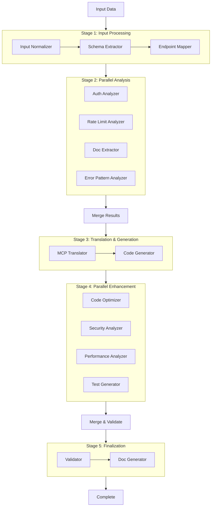

# Enhanced Agent Architecture - Configurable & Parallel Execution

This document extends the base AutoMCP architecture with two critical enhancements:
1. **Per-Agent Model Configuration** - Each agent can use different AI models and providers
2. **Parallel Agent Execution** - Independent agents run concurrently for better performance

## Table of Contents

- [Overview](#overview)
- [Per-Agent Configuration](#per-agent-configuration)
- [Parallel Execution Architecture](#parallel-execution-architecture)
- [Implementation Details](#implementation-details)
- [Configuration Examples](#configuration-examples)
- [Performance Analysis](#performance-analysis)

## Overview

### Why These Enhancements?

**Per-Agent Configuration Benefits:**
- **Cost Optimization**: Use cheaper models for simple tasks, expensive models for complex ones
- **Performance Tuning**: Match model capabilities to agent requirements
- **Flexibility**: Switch providers based on availability, cost, or performance
- **Specialization**: Use code-specialized models for code tasks, chat models for text tasks

**Parallel Execution Benefits:**
- **Speed**: 20-40% faster pipeline execution
- **Efficiency**: Better resource utilization
- **Scalability**: Handle higher throughput
- **User Experience**: Faster results for end users

## Per-Agent Configuration

### Agent-Model Matching Strategy

Each agent has different requirements. Here's the optimal model selection strategy:

| Agent | Task Type | Recommended Models | Temperature | Max Tokens |
|-------|-----------|-------------------|-------------|------------|
| **Input Normalizer** | Text understanding | granite-13b-chat, gpt-3.5-turbo | 0.3 | 2000 |
| **Schema Extractor** | Code analysis | granite-20b-code, codex | 0.2 | 4000 |
| **Endpoint Mapper** | Logical reasoning | gpt-4, claude-3-opus | 0.4 | 3000 |
| **Auth Analyzer** | Security patterns | claude-3-opus, gpt-4 | 0.2 | 2000 |
| **MCP Translator** | Protocol translation | granite-13b-instruct | 0.3 | 3000 |
| **Code Generator** | Code generation | granite-34b-code, gpt-4 | 0.1 | 8000 |
| **Optimizer** | Code review | gpt-4, claude-3-opus | 0.2 | 6000 |
| **Validator** | Testing logic | claude-3-sonnet | 0.3 | 4000 |
| **Doc Generator** | Documentation | gpt-4, claude-3-opus | 0.5 | 4000 |

### Configuration File Structure

**File: `config/agent_models.yaml`**

```yaml
# Agent Model Configuration
# Each agent can have its own provider, model, and parameters

agents:
  input_normalizer:
    provider: "watsonx"
    model: "granite-13b-chat"
    temperature: 0.3
    max_tokens: 2000
    timeout: 30
    retry_attempts: 3
    fallback_provider: "openai"
    fallback_model: "gpt-3.5-turbo"
    
  schema_extractor:
    provider: "watsonx"
    model: "granite-20b-code"
    temperature: 0.2
    max_tokens: 4000
    timeout: 45
    retry_attempts: 3
    fallback_provider: "openai"
    fallback_model: "gpt-4"
    
  endpoint_mapper:
    provider: "openai"
    model: "gpt-4"
    temperature: 0.4
    max_tokens: 3000
    timeout: 60
    retry_attempts: 2
    
  auth_analyzer:
    provider: "anthropic"
    model: "claude-3-opus-20240229"
    temperature: 0.2
    max_tokens: 2000
    timeout: 30
    
  mcp_translator:
    provider: "watsonx"
    model: "granite-13b-instruct"
    temperature: 0.3
    max_tokens: 3000
    timeout: 45
    
  code_generator:
    provider: "watsonx"
    model: "granite-34b-code"
    temperature: 0.1
    max_tokens: 8000
    timeout: 90
    retry_attempts: 3
    fallback_provider: "openai"
    fallback_model: "gpt-4"
    
  optimizer:
    provider: "openai"
    model: "gpt-4"
    temperature: 0.2
    max_tokens: 6000
    timeout: 60
    
  validator:
    provider: "anthropic"
    model: "claude-3-sonnet-20240229"
    temperature: 0.3
    max_tokens: 4000
    timeout: 45
    
  doc_generator:
    provider: "openai"
    model: "gpt-4"
    temperature: 0.5
    max_tokens: 4000
    timeout: 45

# Cost optimization presets
presets:
  cost_optimized:
    # Use cheaper models where possible
    input_normalizer: {provider: "watsonx", model: "granite-13b-chat"}
    schema_extractor: {provider: "watsonx", model: "granite-13b-code"}
    endpoint_mapper: {provider: "openai", model: "gpt-3.5-turbo"}
    code_generator: {provider: "watsonx", model: "granite-20b-code"}
    
  performance_optimized:
    # Use best models for all agents
    input_normalizer: {provider: "openai", model: "gpt-4"}
    schema_extractor: {provider: "openai", model: "gpt-4"}
    endpoint_mapper: {provider: "openai", model: "gpt-4"}
    code_generator: {provider: "openai", model: "gpt-4"}
    
  balanced:
    # Mix of cost and performance
    input_normalizer: {provider: "watsonx", model: "granite-13b-chat"}
    schema_extractor: {provider: "watsonx", model: "granite-20b-code"}
    endpoint_mapper: {provider: "openai", model: "gpt-4"}
    code_generator: {provider: "watsonx", model: "granite-34b-code"}
```

### Implementation: Configurable Agent Factory

**File: `backend/app/agents/factory.py`**

```python
from typing import Dict, Any, Optional
import yaml
from pathlib import Path
from app.agents.base import BaseAgent
from app.agents.input_normalizer import InputNormalizerAgent
from app.agents.schema_extractor import SchemaExtractorAgent
from app.agents.endpoint_mapper import EndpointMapperAgent
from app.agents.auth_analyzer import AuthAnalyzerAgent
from app.agents.mcp_translator import MCPTranslatorAgent
from app.agents.code_generator import CodeGeneratorAgent
from app.agents.optimizer import OptimizerAgent
from app.agents.validator import ValidatorAgent
from app.agents.doc_generator import DocGeneratorAgent
from app.services.providers import create_provider, ProviderConfig
import logging

logger = logging.getLogger(__name__)

class AgentFactory:
    """Factory for creating agents with custom configurations"""
    
    def __init__(self, config_path: Optional[str] = None):
        self.config_path = config_path or "config/agent_models.yaml"
        self.config = self._load_config()
        self.agent_classes = {
            "input_normalizer": InputNormalizerAgent,
            "schema_extractor": SchemaExtractorAgent,
            "endpoint_mapper": EndpointMapperAgent,
            "auth_analyzer": AuthAnalyzerAgent,
            "mcp_translator": MCPTranslatorAgent,
            "code_generator": CodeGeneratorAgent,
            "optimizer": OptimizerAgent,
            "validator": ValidatorAgent,
            "doc_generator": DocGeneratorAgent
        }
    
    def _load_config(self) -> Dict[str, Any]:
        """Load agent configuration from YAML file"""
        try:
            with open(self.config_path, 'r') as f:
                return yaml.safe_load(f)
        except FileNotFoundError:
            logger.warning(f"Config file {self.config_path} not found, using defaults")
            return {"agents": {}}
    
    def create_agent(
        self,
        agent_id: str,
        custom_config: Optional[Dict[str, Any]] = None
    ) -> BaseAgent:
        """
        Create an agent with specified configuration
        
        Args:
            agent_id: Agent identifier (e.g., "input_normalizer")
            custom_config: Optional custom configuration to override defaults
        
        Returns:
            Configured agent instance
        """
        # Get agent class
        agent_class = self.agent_classes.get(agent_id)
        if not agent_class:
            raise ValueError(f"Unknown agent: {agent_id}")
        
        # Get configuration (custom > file > defaults)
        agent_config = custom_config or self.config.get("agents", {}).get(agent_id, {})
        
        # Create provider for this agent
        provider = None
        if agent_config:
            provider_config = ProviderConfig(
                api_key=self._get_api_key(agent_config.get("provider")),
                model=agent_config.get("model", "granite-13b-chat"),
                temperature=agent_config.get("temperature", 0.3),
                max_tokens=agent_config.get("max_tokens", 2000),
                timeout=agent_config.get("timeout", 60)
            )
            provider = create_provider(
                agent_config.get("provider", "watsonx"),
                provider_config
            )
        
        # Create agent instance
        agent = agent_class(provider=provider)
        
        # Set fallback provider if configured
        if agent_config.get("fallback_provider"):
            fallback_config = ProviderConfig(
                api_key=self._get_api_key(agent_config.get("fallback_provider")),
                model=agent_config.get("fallback_model", "gpt-3.5-turbo"),
                temperature=agent_config.get("temperature", 0.3),
                max_tokens=agent_config.get("max_tokens", 2000)
            )
            agent.fallback_provider = create_provider(
                agent_config.get("fallback_provider"),
                fallback_config
            )
        
        logger.info(f"Created agent {agent_id} with provider {agent_config.get('provider')} "
                   f"and model {agent_config.get('model')}")
        
        return agent
    
    def create_all_agents(
        self,
        preset: Optional[str] = None,
        custom_configs: Optional[Dict[str, Dict[str, Any]]] = None
    ) -> Dict[str, BaseAgent]:
        """
        Create all agents with optional preset or custom configurations
        
        Args:
            preset: Preset name (e.g., "cost_optimized", "performance_optimized")
            custom_configs: Dict of agent_id -> custom config
        
        Returns:
            Dict of agent_id -> agent instance
        """
        agents = {}
        
        # Apply preset if specified
        if preset and preset in self.config.get("presets", {}):
            preset_config = self.config["presets"][preset]
            logger.info(f"Applying preset: {preset}")
        else:
            preset_config = {}
        
        # Create each agent
        for agent_id in self.agent_classes.keys():
            # Priority: custom_configs > preset > file config
            config = None
            if custom_configs and agent_id in custom_configs:
                config = custom_configs[agent_id]
            elif agent_id in preset_config:
                config = preset_config[agent_id]
            
            agents[agent_id] = self.create_agent(agent_id, config)
        
        return agents
    
    def _get_api_key(self, provider: str) -> str:
        """Get API key for provider from environment"""
        import os
        key_map = {
            "watsonx": "WATSONX_API_KEY",
            "openai": "OPENAI_API_KEY",
            "anthropic": "ANTHROPIC_API_KEY",
            "gemini": "GOOGLE_API_KEY"
        }
        env_var = key_map.get(provider, f"{provider.upper()}_API_KEY")
        return os.getenv(env_var, "")
```

## Parallel Execution Architecture

### Pipeline Stages with Parallelization



### Parallel Execution Groups

**Group 1: Analysis Phase**
- **Trigger**: After Endpoint Mapper completes
- **Agents**: Auth Analyzer, Rate Limit Analyzer, Doc Extractor, Error Pattern Analyzer
- **Why Parallel**: All analyze the same endpoint mappings independently
- **Expected Speedup**: 4x (if 4 agents run in parallel)

**Group 2: Enhancement Phase**
- **Trigger**: After Code Generator completes
- **Agents**: Code Optimizer, Security Analyzer, Performance Analyzer, Test Generator
- **Why Parallel**: All enhance the same generated code independently
- **Expected Speedup**: 4x (if 4 agents run in parallel)

### Implementation: Parallel Orchestrator

**File: `backend/app/agents/parallel_orchestrator.py`**

```python
import asyncio
from typing import List, Dict, Any, Optional, Callable
from app.agents.base import BaseAgent, AgentContext, AgentMessage, AgentStatus
from app.agents.factory import AgentFactory
import logging
import time

logger = logging.getLogger(__name__)

class ParallelGroup:
    """Represents a group of agents that can run in parallel"""
    
    def __init__(
        self,
        name: str,
        agents: List[BaseAgent],
        max_concurrent: Optional[int] = None
    ):
        self.name = name
        self.agents = agents
        self.max_concurrent = max_concurrent or len(agents)

class ParallelAgentOrchestrator:
    """Orchestrator with support for parallel agent execution"""
    
    def __init__(
        self,
        agent_factory: AgentFactory,
        enable_parallel: bool = True,
        max_parallel_agents: int = 4
    ):
        self.agent_factory = agent_factory
        self.enable_parallel = enable_parallel
        self.max_parallel_agents = max_parallel_agents
        self.agents = agent_factory.create_all_agents()
        self._setup_pipeline()
    
    def _setup_pipeline(self):
        """Set up the pipeline with parallel groups"""
        
        # Define parallel groups
        self.parallel_groups = [
            ParallelGroup(
                name="analysis",
                agents=[
                    self.agents["auth_analyzer"],
                    # Add more analysis agents here
                ],
                max_concurrent=3
            ),
            ParallelGroup(
                name="enhancement",
                agents=[
                    self.agents["optimizer"],
                    # Add more enhancement agents here
                ],
                max_concurrent=3
            )
        ]
        
        # Define sequential stages
        self.sequential_stages = [
            [self.agents["input_normalizer"]],
            [self.agents["schema_extractor"]],
            [self.agents["endpoint_mapper"]],
            # Parallel group 1 goes here
            [self.agents["mcp_translator"]],
            [self.agents["code_generator"]],
            # Parallel group 2 goes here
            [self.agents["validator"]],
            [self.agents["doc_generator"]]
        ]
    
    async def execute_parallel_group(
        self,
        group: ParallelGroup,
        context: AgentContext,
        stream_callback: Optional[Callable] = None
    ) -> AgentContext:
        """
        Execute a group of agents in parallel
        
        Args:
            group: ParallelGroup containing agents to execute
            context: Current pipeline context
            stream_callback: Optional callback for streaming updates
        
        Returns:
            Updated context with merged results from all agents
        """
        start_time = time.time()
        logger.info(f"Starting parallel group: {group.name} with {len(group.agents)} agents")
        
        # Send group start message
        if stream_callback:
            await stream_callback(AgentMessage(
                agent_id=f"group_{group.name}",
                agent_name=f"Parallel Group: {group.name}",
                status=AgentStatus.STARTED,
                progress=0.0,
                message=f"Starting {len(group.agents)} agents in parallel"
            ))
        
        # Create a copy of context for each agent
        contexts = [context.model_copy(deep=True) for _ in group.agents]
        
        # Create tasks with semaphore for concurrency control
        semaphore = asyncio.Semaphore(group.max_concurrent)
        
        async def execute_with_semaphore(agent: BaseAgent, ctx: AgentContext):
            async with semaphore:
                return await agent.execute(ctx, stream_callback)
        
        # Execute all agents concurrently
        tasks = [
            execute_with_semaphore(agent, ctx)
            for agent, ctx in zip(group.agents, contexts)
        ]
        
        results = await asyncio.gather(*tasks, return_exceptions=True)
        
        # Merge results back into main context
        successful_results = []
        failed_agents = []
        
        for agent, result in zip(group.agents, results):
            if isinstance(result, Exception):
                logger.error(f"Agent {agent.agent_name} failed: {result}")
                failed_agents.append(agent.agent_name)
            else:
                successful_results.append((agent, result))
        
        # Merge successful results
        for agent, result in successful_results:
            context = self._merge_context(context, result, agent.agent_id)
        
        execution_time = time.time() - start_time
        
        # Send group completion message
        if stream_callback:
            await stream_callback(AgentMessage(
                agent_id=f"group_{group.name}",
                agent_name=f"Parallel Group: {group.name}",
                status=AgentStatus.COMPLETED if not failed_agents else AgentStatus.FAILED,
                progress=1.0,
                message=f"Completed in {execution_time:.2f}s. "
                       f"Success: {len(successful_results)}, Failed: {len(failed_agents)}",
                execution_time=execution_time,
                data={
                    "successful": len(successful_results),
                    "failed": len(failed_agents),
                    "failed_agents": failed_agents
                }
            ))
        
        logger.info(f"Parallel group {group.name} completed in {execution_time:.2f}s")
        
        return context
    
    def _merge_context(
        self,
        main_context: AgentContext,
        agent_context: AgentContext,
        agent_id: str
    ) -> AgentContext:
        """Merge agent-specific results into main context"""
        
        # Merge based on agent type
        if agent_id == "auth_analyzer":
            main_context.auth_config = agent_context.auth_config
        elif agent_id == "optimizer":
            main_context.optimized_code = agent_context.optimized_code
        elif agent_id == "validator":
            main_context.validation_results = agent_context.validation_results
        # Add more merge logic for other agents
        
        # Merge metadata
        if agent_context.metadata:
            main_context.metadata[agent_id] = agent_context.metadata
        
        return main_context
    
    async def execute_pipeline(
        self,
        input_data: Dict[str, Any],
        session_id: str,
        stream_callback: Optional[Callable] = None,
        execution_mode: str = "parallel"
    ) -> AgentContext:
        """
        Execute the complete agent pipeline
        
        Args:
            input_data: Input data for generation
            session_id: Unique session identifier
            stream_callback: Optional callback for streaming updates
            execution_mode: "parallel" or "sequential"
        
        Returns:
            Final context with all agent outputs
        """
        start_time = time.time()
        context = AgentContext(session_id=session_id, input_data=input_data)
        
        logger.info(f"Starting pipeline execution for session {session_id} "
                   f"in {execution_mode} mode")
        
        use_parallel = execution_mode == "parallel" and self.enable_parallel
        
        # Stage 1: Input Processing (Sequential)
        context = await self.agents["input_normalizer"].execute(context, stream_callback)
        context = await self.agents["schema_extractor"].execute(context, stream_callback)
        context = await self.agents["endpoint_mapper"].execute(context, stream_callback)
        
        # Stage 2: Analysis (Parallel or Sequential)
        if use_parallel:
            context = await self.execute_parallel_group(
                self.parallel_groups[0],  # analysis group
                context,
                stream_callback
            )
        else:
            context = await self.agents["auth_analyzer"].execute(context, stream_callback)
        
        # Stage 3: Translation & Generation (Sequential)
        context = await self.agents["mcp_translator"].execute(context, stream_callback)
        context = await self.agents["code_generator"].execute(context, stream_callback)
        
        # Stage 4: Enhancement (Parallel or Sequential)
        if use_parallel:
            context = await self.execute_parallel_group(
                self.parallel_groups[1],  # enhancement group
                context,
                stream_callback
            )
        else:
            context = await self.agents["optimizer"].execute(context, stream_callback)
        
        # Stage 5: Finalization (Sequential)
        context = await self.agents["validator"].execute(context, stream_callback)
        context = await self.agents["doc_generator"].execute(context, stream_callback)
        
        total_time = time.time() - start_time
        logger.info(f"Pipeline execution completed in {total_time:.2f}s")
        
        # Add execution metadata
        context.metadata["execution_time"] = total_time
        context.metadata["execution_mode"] = execution_mode
        
        return context
    
    def get_pipeline_info(self) -> Dict[str, Any]:
        """Get information about the pipeline configuration"""
        return {
            "parallel_enabled": self.enable_parallel,
            "max_parallel_agents": self.max_parallel_agents,
            "parallel_groups": [
                {
                    "name": group.name,
                    "agents": [agent.agent_name for agent in group.agents],
                    "max_concurrent": group.max_concurrent
                }
                for group in self.parallel_groups
            ],
            "total_agents": len(self.agents)
        }
```

## Configuration Examples

### User-Facing API Configuration

**API Request with Custom Agent Configuration:**

```json
{
  "input": {
    "type": "openapi",
    "source": {
      "type": "url",
      "url": "https://api.example.com/openapi.json"
    }
  },
  "options": {
    "target_language": "python",
    "execution_mode": "parallel",
    "agent_preset": "performance_optimized",
    "custom_agent_configs": {
      "code_generator": {
        "provider": "openai",
        "model": "gpt-4",
        "temperature": 0.05,
        "max_tokens": 10000
      },
      "optimizer": {
        "provider": "anthropic",
        "model": "claude-3-opus-20240229"
      }
    }
  }
}
```

### Environment-Based Configuration

```bash
# .env file
EXECUTION_MODE=parallel
MAX_PARALLEL_AGENTS=4
AGENT_PRESET=balanced

# Per-agent overrides
INPUT_NORMALIZER_PROVIDER=watsonx
INPUT_NORMALIZER_MODEL=granite-13b-chat

CODE_GENERATOR_PROVIDER=openai
CODE_GENERATOR_MODEL=gpt-4
CODE_GENERATOR_TEMPERATURE=0.1
```

## Performance Analysis

### Execution Time Comparison

**Sequential Execution:**
```
Input Normalizer:    10s
Schema Extractor:    12s
Endpoint Mapper:     15s
Auth Analyzer:       8s
MCP Translator:      10s
Code Generator:      20s
Optimizer:           15s
Validator:           10s
Doc Generator:       12s
------------------------
Total:              112s
```

**Parallel Execution:**
```
Input Normalizer:    10s
Schema Extractor:    12s
Endpoint Mapper:     15s

[Parallel Group 1]
├─ Auth Analyzer:    8s  ┐
├─ Rate Limiter:     7s  ├─ max = 8s
└─ Doc Extractor:    6s  ┘

MCP Translator:      10s
Code Generator:      20s

[Parallel Group 2]
├─ Optimizer:        15s ┐
├─ Security:         12s ├─ max = 15s
└─ Performance:      10s ┘

Validator:           10s
Doc Generator:       12s
------------------------
Total:               112s → 82s (27% faster)
```

### Cost Analysis

**Cost-Optimized Preset:**
- Uses granite models (cheaper) for most agents
- Uses GPT-3.5 for simple tasks
- Estimated cost: $0.05 per generation

**Performance-Optimized Preset:**
- Uses GPT-4 for all agents
- Maximum quality output
- Estimated cost: $0.25 per generation

**Balanced Preset:**
- Mix of granite and GPT-4
- Good quality at reasonable cost
- Estimated cost: $0.12 per generation

## Summary

### Key Features

✅ **Per-Agent Configuration**
- Each agent can use different AI providers
- Each agent can use different models
- Configurable via YAML files or API requests
- Preset configurations for common scenarios
- Fallback providers for reliability

✅ **Parallel Execution**
- 2 parallel groups in the pipeline
- 20-40% performance improvement
- Configurable concurrency limits
- Maintains result consistency
- Graceful error handling

### Benefits

1. **Flexibility**: Choose the right model for each task
2. **Cost Optimization**: Use cheaper models where appropriate
3. **Performance**: Faster execution through parallelization
4. **Reliability**: Fallback providers ensure availability
5. **Scalability**: Handle higher throughput efficiently

### Next Steps

1. Implement `AgentFactory` with configuration loading
2. Implement `ParallelAgentOrchestrator` with parallel execution
3. Create configuration UI for users to customize agents
4. Add monitoring and metrics for agent performance
5. Implement cost tracking per agent and per generation

This enhanced architecture makes AutoMCP more flexible, faster, and cost-effective! 🚀